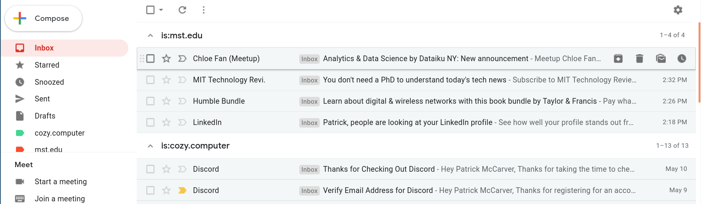

You can set up multiple inboxes in Gmail so that forwarded emails all appear in their own inbox.

It's setup so that:
- forwarded email from `something@mst.edu` goes to the `mst.edu` inbox
- email for the current address `something@cozy.computer` goes to the `cozy.computer` inbox:

#### Setting up multiple inboxes
This assumes you've already set up forwarding from the old email address to the current address and are logged in to the current address.

##### Create labels

Go to Settings/Labels and click `Create new label`. Make two new labels: one for the forwarded emails and one for non-forwarded emails. Mine were called `mst.edu` (forwarded emails from my old university email address) and `cozy.computer` (non-forwarded emails).

##### Create filters

Go to Settings/Filters and Blocked Addresses and click `Create a new filter`. Create three new filters and apply the labels we created earlier:
- Filter email from your forwarding email. Put your forwarding email in the `From` field and apply the forwarded emails label ex `mst.edu`
- Filter email to your forwarding email. Put your forwarding email in the `To` field and apply the forwarded emails label ex `mst.edu`
- Filter bcc email To your forwarding email. Put `deliveredto:something@mst.edu` in the `Has the words` field and apply the forwarded emails label ex `mst.edu`
- Filter all other emails. Put `-something@mst.edu` in the `To` field. The `-` means `NOT`. It matches all emails that weren't sent to`something@mst.edu`. Unfortunately I think it won't catch a few things, like bcc emails, which might end up in both inboxes. It also doesn't catch emails from Google Payments or G Suite for some reason.

##### Create inboxes

Go to Settings/Inbox, change Inbox type to `Multiple inboxes`. Place your labels in the `Multiple inbox sections` area and click `Save changes`:
- Section 1: `is:mst.edu`
- Section 2: `is:cozy.computer`

##### Enjoy

Now emails intended for the old email address will appear in the `mst.edu` inbox and emails intended for the current address will appear in the `cozy.computer` inbox.
